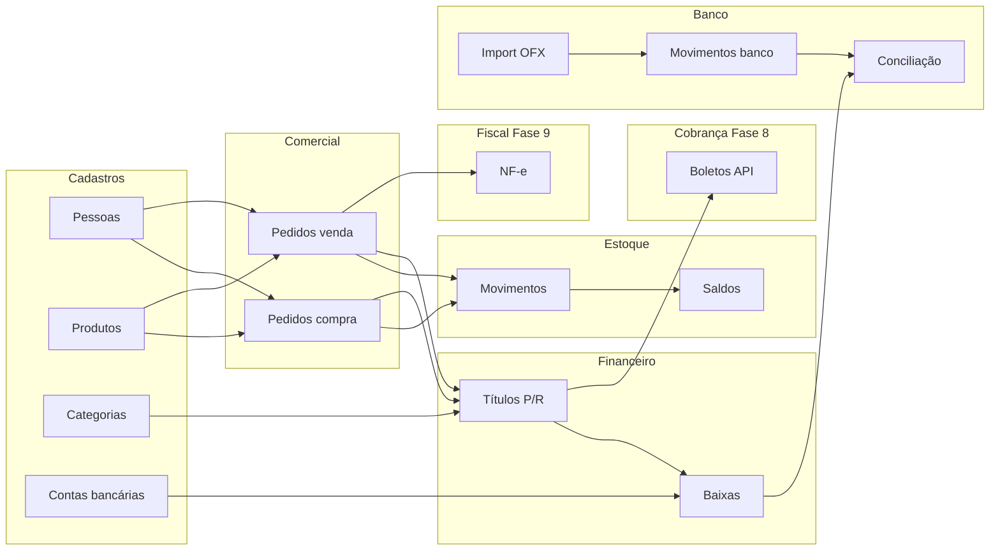

# PRD — Norte

**Produto:** Norte  
**Versão do documento:** 0.2  
**Data:** Agosto/2026  
**Status:** Especificação inicial (greenfield)

---

## 1. Visão do Produto

O **Norte** é um ERP operacional mínimo para pequenas e médias empresas: cadastros, vendas, compras, estoque, contas a pagar/receber e conciliação bancária — em uma aplicação desktop (webview) e/ou servidor HTTP headless, com interface web leve (SSR + HTMX).

Após o MVP operacional, o produto evolui com **cobrança bancária** (boletos via API externa) e **fiscal** (NF-e de saída), sem acoplar SEFAZ ou provedores de boleto ao fluxo de confirmação de compra/venda.

Inspiração de UX e stack no **Norte-Finan** (Go, templates, HTMX, Tailwind, Turso/SQLite). É um **produto novo**: schema, domínio e posicionamento próprios — não é evolução nem complemento de outro ERP.

**Frase de produto:**  
> Cadastrar, comprar, vender, controlar estoque, gerar títulos e conciliar com o banco — sem planilha e sem sistema legado.

---

## 2. Objetivos de Negócio

| ID | Objetivo | Indicador de sucesso |
|----|----------|----------------------|
| O1 | Centralizar operação comercial e financeira no dia a dia | Pedido/compra → estoque → título sem ferramentas paralelas |
| O2 | Reduzir tempo em planilhas e conciliação manual | Extrato OFX conciliado no próprio sistema |
| O3 | Dar visibilidade de caixa e títulos | Fluxo de caixa + abertos/vencidos usados semanalmente |
| O4 | Manter dados rápidos e portáteis | Modo local/sync utilizável offline parcial |
| O5 | Entregar MVP usável em fases curtas | Cada fase demoable em produção local |
| O6 | Cobrar títulos sem sair do sistema (pós-MVP) | Boleto gerado via API a partir do título R |
| O7 | Emitir NF-e de saída alinhada à venda (pós-MVP) | NF-e autorizada em homologação/produção a partir da venda |

---

## 3. Público-Alvo

- PMEs com venda de produtos (estoque físico simples)
- Equipes pequenas (1–10 usuários) financeiro + operacional
- Empresas que precisam de compras + vendas + caixa no mesmo lugar
- Usuários que valorizam app desktop / UI simples, sem SPA pesada

**Fora do público inicial:** indústria com MRP, rede varejista multi-PDV, holding multi-tenant complexa, escritório contábil puro.

---

## 4. Princípios de Produto e Arquitetura

1. **Monolito Go** — `net/http` stdlib, handlers por domínio  
2. **SSR + HTMX** — interatividade onde importa (listas, conciliação, filtros); sem framework JS de UI  
3. **Desktop-first + headless** — webview nativo e binário servidor  
4. **SQLite / Turso** — modos `local`, `remote`, `sync`  
5. **Schema magro** — campos essenciais na v1; evitar modelagem “ERP gigante”  
6. **Uma operação, um efeito claro** — confirmar venda/compra mexe estoque/título de forma explícita e atômica; boleto e NF-e são passos **posteriores e opcionais**  
7. **UI em português** — flash messages e labels de negócio em PT  
8. **Migrações incrementais** — Goose; nunca editar migração já aplicada  
9. **Escopo mínimo por fase** — nada de feature “por precaução”  
10. **Integrações atrás de adaptadores** — `CobrancaProvider`, `FiscalProvider`; credenciais fora do código  

**Stack alvo (espelho Norte-Finan):**

| Camada | Tecnologia |
|--------|------------|
| Backend | Go 1.25+, `net/http` |
| Banco | Turso / LibSQL / SQLite |
| Migrações | Goose v3 |
| Frontend | Go Templates + HTMX |
| CSS | Tailwind CSS v4 |
| Desktop | webview (`!headless` / `headless`) |
| Segurança | CSRF + sessões + bcrypt |
| Config | Viper (`norte.conf`) |
| Integrações (pós-MVP) | HTTP clients para API de boleto e emissão NF-e |

---

## 5. Não-Objetivos (MVP operacional — Fases 0–7)

Explicitamente **fora** do MVP operacional:

- Geração de boletos / Pix cobrança via API (**Fase 8**; ver §7.10)  
- Emissão fiscal NF-e / NFC-e / NFS-e / SEFAZ (**Fase 9**; ver §7.11)  
- Contabilidade fiscal / SPED  
- PDV touch / balança / TEF  
- Multi-depósito / WMS / picking  
- Custo médio/FIFO avançado, inventário cíclico sofisticado  
- Produção / engenharia de produto / MRP  
- Folha de pagamento, CRM avançado, e-commerce  
- Multi-tenancy SaaS, papéis granulares (além de admin/usuário simples se necessário)  
- API pública REST na v1 (salvo necessidade interna pontual)  
- CNAB 240/400 próprio / remessa-retorno por arquivo  

Até as Fases 8 e 9, cobrança e fiscal podem coexistir com **emissor/provedor externo** ou processo manual (boleto no banco, NF no contador).

---

## 6. Jornada Ponta a Ponta

### 6.1 Cenário feliz — MVP operacional (Fases 0–7)

1. Admin configura empresa, unidade, usuário, conta bancária e categorias.  
2. Cadastra **fornecedor**, **cliente** e **produtos** (SKU, unidade, preço).  
3. Lança **pedido de compra** → confirma **entrada** → estoque sobe → gera **título a pagar**.  
4. Lança **pedido de venda** / fatura → confirma → estoque desce → gera **título a receber**.  
5. Registra **baixas** (parcial/total) nos títulos, associando conta bancária.  
6. Importa **OFX** e **concilia** baixas/movimentos com o extrato.  
7. Consulta **fluxo de caixa**, títulos em aberto e vencidos.

Critério de “substitui planilha”: esse fluxo roda sem Excel para o operacional diário.

### 6.2 Extensão — Cobrança e Fiscal (Fases 8–9)

8. A partir do título R em aberto, **gera boleto** via API externa → PDF/linha digitável persistidos.  
9. Após a venda confirmada, **emite NF-e** → autorização SEFAZ → XML/chave armazenados.  
10. Pagamento do boleto: baixa manual do título e/ou conciliação OFX (webhook automático é Fase 10+).

Vocabulário de UI (obrigatório): **Confirmar venda** ≠ **Gerar boleto** ≠ **Emitir nota**.

---

## 7. Escopo Funcional por Módulo

### 7.1 Plataforma

- Setup de primeiro acesso  
- Login / logout / troca de senha  
- Usuários (CRUD básico)  
- Empresa e unidades (filiais)  
- Configuração (`norte.conf`): DB, endereço, nome exibido  

**Aceite:** instalação local sobe, cria admin, autentica, navega shell com menu.

### 7.2 Cadastros

| Cadastro | Essencial v1 |
|----------|----------------|
| Papéis | código + nome; seed cliente/fornecedor/vendedor/representante |
| Pessoas | PF/PJ, nome, CPF/CNPJ opcional, contato, endereço magro; papéis N:N via `pessoa_papeis` |
| Produtos | código, descrição, unidade, preços, flag controla estoque, estoque mínimo |
| Categorias financeiras | entrada/saída (+ classe de despesa opcional) |
| Bancos / contas bancárias | FEBRABAN ou cadastro manual + conta |
| Condições de pagamento | ex.: à vista, 30 dias, 30/60 (gera N títulos) — MVP pode começar com à vista + N dias únicos |

**Aceite:** CRUD completo; validações básicas; itens no menu.

### 7.3 Compras

- Pedido de compra: fornecedor, itens (produto, qtd, valor), status (`rascunho`, `confirmado`, `cancelado`)  
- Confirmação gera:
  - movimento de estoque **entrada** (produtos que controlam estoque)
  - um ou mais **títulos a pagar** (conforme condição)  
- Listagem com filtros (período, fornecedor, status)  
- Cancelamento só se regras de negócio permitirem (ex.: sem baixa de título / estorno explícito na fase 2+)

**Aceite:** compra confirmada aumenta saldo e cria título P com saldo correto.

### 7.4 Vendas

- Pedido/fatura de venda: cliente, itens, totais, status  
- Confirmação gera:
  - movimento de estoque **saída**
  - um ou mais **títulos a receber**  
- Bloquear confirmação se estoque insuficiente (configurável: bloquear vs. avisar — **v1: bloquear**)  
- Listagem e filtros

**Aceite:** venda confirmada reduz saldo e cria título R; estoque insuficiente impede confirmação.

### 7.5 Estoque

- Saldo por produto (e por unidade/empresa se multi-unidade na v1 — **mínimo: por empresa**)  
- Movimentos: entrada, saída, ajuste manual  
- Histórico por produto  
- Sem custo/valorização complexa na v1 (custo opcional informativo no produto, sem ledger de custo)

**Aceite:** saldos batem com soma dos movimentos; ajuste altera saldo com rastreio.

### 7.6 Contas a Pagar e Receber

- Tabela unificada `titulos` com `tipo` = `P` | `R`  
- Campos essenciais: pessoa, origem (compra/venda/manual), valor, saldo, emissão, vencimento, status (`A` aberto, `P` parcial, `B` baixado, `C` cancelado), categoria, conta sugerida  
- Baixas parciais/totais: valor, desconto, juros/multa simples, data, conta  
- Título manual (sem documento comercial) para ajustes  
- Telas: a pagar, a receber, baixas, abertos, vencidos  

**Aceite:** baixa atualiza saldo/status; título baixado não aceita nova baixa sem estorno (estorno pode ser fase seguinte — v1: não permitir baixa além do saldo).

### 7.7 Banco e Conciliação

- Importação OFX com idempotência por FITID  
- Movimentos bancários por conta  
- Painel de conciliação (estilo Norte-Finan): lado a lado título/baixa ou lançamento × extrato  
- Vínculo baixa ↔ movimento bancário  

**Aceite:** reimportar mesmo OFX não duplica; vínculo e desvínculo rastreáveis.

### 7.8 Relatórios (v1)

- Fluxo de caixa (realizado + previsto a partir de títulos em aberto)  
- Títulos em aberto / vencidos  
- Extrato por conta (movimentos OFX + baixas vinculadas)  
- Export CSV dos relatórios principais  

**Aceite:** números reconciliam com títulos/baixas/OFX do período.

### 7.9 Orçamento (fase posterior — ver Fase 10+)

- Metas por categoria/mês e comparativo realizado vs. orçado  
- Não bloqueia go-live operacional nem Cobrança/Fiscal

### 7.10 Cobrança bancária — Boletos (API externa) — Fase 8

Objetivo: emitir boletos de cobrança para títulos a receber via **provedor externo**, sem motor bancário próprio (CNAB, registro local, etc.).

**Incluído (Cobrança v1):**

- Configuração do provedor: API key / client credentials, ambiente sandbox/produção, conta de recebimento padrão  
- Ação **Gerar boleto** a partir de título R em aberto (sem cobrança ativa)  
- Envio à API: valor, vencimento, sacado (dados da pessoa), chave de idempotência  
- Persistência em `cobrancas`: provedor, id externo, linha digitável, código de barras, URL/PDF, status (`pendente`, `registrado`, `pago`, `cancelado`, `expirado`), `titulo_id`  
- Download/reimpressão do PDF  
- Cancelamento no provedor (se a API permitir) + status local  
- Listagem de cobranças + acesso a partir do título  

**Arquitetura:**

- Interface `CobrancaProvider` + uma implementação na v1 (agregador preferível a banco específico)  
- Credenciais em `norte.conf` / env — nunca commitadas  
- HTTP com timeout, retry idempotente, erro legível na UI  

**Regras:**

- Boleto **não** gera estoque nem novo título  
- 1 título R → no máximo 1 cobrança ativa (v1)  
- Pagamento do boleto **não** baixa o título automaticamente na Cobrança v1 (baixa manual ou OFX; webhook na Fase 10+)  
- Falha na API não altera status do título  

**Fora da Cobrança v1:**

- Pix cobrança / Pix automático  
- CNAB próprio  
- Split, recorrência, carnê visual (além de N títulos → N boletos)  
- Multi-provedor simultâneo  
- Baixa automática por webhook  

**Aceite:** em sandbox, gerar boleto para título R, persistir linha/PDF/id externo, reimprimir, cancelar; título permanece aberto até baixa manual/OFX.

### 7.11 Fiscal — NF-e de saída — Fase 9

Objetivo: emitir e armazenar documentos fiscais de saída alinhados às vendas, sem transformar o Norte em motor contábil.

**Incluído (Fiscal v1):**

- Cadastros fiscais mínimos: CFOP, CST/CSOSN (ou NCM + origem), regime da empresa (o necessário para montar o XML)  
- Dados fiscais no produto: NCM, origem, unidade tributável  
- Dados fiscais na pessoa (destinatário): IE, indicador IE, endereço completo  
- Fluxo: venda confirmada → **Emitir NF-e** → transmissão → autorização / rejeição  
- Persistência em `documentos_fiscais`: chave, número/série, status, XML, protocolo, motivo de rejeição, vínculo `pedido_venda_id`  
- Cancelamento e carta de correção (CC-e) básicos  
- Download/reimpressão de XML/DANFE (PDF via lib ou provedor)  
- Vínculo 1:1 documento fiscal ↔ pedido de venda na v1  

**Arquitetura alvo:**

- Interface `FiscalProvider`  
- Preferência inicial: **provedor de emissão** (API) para reduzir risco SEFAZ; emissão local (lib + A1) como evolução se precisar offline  
- Ambientes homologação e produção configuráveis  

**Regras:**

- Documento fiscal **não** gera estoque nem título de novo (já ocorreram na confirmação da venda)  
- Rejeição SEFAZ não desfaz a venda; usuário corrige e reenvia  
- Cancelamento fiscal pode exigir estorno operacional — na Fiscal v1, só cancelar NF se a venda ainda permitir estorno ou via fluxo guiado  

**Fora da Fiscal v1:**

- NFC-e / SAT / MFE  
- NFS-e (municípios)  
- Manifestação / descarga de XML de compra (Fiscal avançado)  
- SPED, EFD, reforma tributária completa  
- Multi-empresa com regras fiscais distintas além de homologação/produção  

**Aceite:** em homologação, autorizar NF-e a partir de uma venda, gravar chave/XML, baixar DANFE, cancelar no prazo simulado; reenvio após rejeição sem numeração indevida.

Até a Fase 9, a empresa pode usar **emissor externo** (app do contador, SaaS de NF-e, etc.) em paralelo ao faturamento interno do Norte.

---

## 8. Fluxo de Dados (visão)



---

## 9. Modelagem Mínima (diretriz — detalhar em `modelagem.md`)

Entidades centrais (orientação; tipos/FKs no doc de modelagem):

| Entidade | Papel |
|----------|--------|
| `users` | Autenticação |
| `empresas` / `unidades` | Contexto organizacional |
| `papeis` / `pessoas` / `pessoa_papeis` | Papéis cadastráveis; PF/PJ (+ campos fiscais na Fase 9) |
| `produtos` | Itens comercializados (+ NCM/origem na Fase 9) |
| `estoque_movimentos` / `estoque_saldos` | Controle de saldo |
| `pedidos_compra` / `pedido_compra_itens` | Compras |
| `pedidos_venda` / `pedido_venda_itens` | Vendas |
| `titulos` / `titulo_baixas` | Contas a pagar/receber |
| `categorias` | Classificação financeira |
| `bancos` / `contas_bancarias` | Contas |
| `movimentacao_banco` | Extrato OFX |
| `cobrancas` | Boleto gerado via API (Fase 8) |
| `documentos_fiscais` | NF-e e status/XML (Fase 9) |
| `orcamentos` | Fase 10+ |

**Regras duras:**

- Confirmar compra/venda é transação única (documento + estoque + títulos).  
- Título guarda `origem_tipo` + `origem_id` (compra, venda, manual).  
- Estoque só mexe com movimento rastreável.  
- `cobrancas.titulo_id` referencia título R; gerar boleto não altera saldo do título.  
- `documentos_fiscais` referencia pedido de venda; emitir NF-e não altera estoque/título.  
- IDs estáveis (TEXT ou INTEGER consistente em todo o schema — **decidir na modelagem e não misturar**).

---

## 10. UI / UX

- Herdar linguagem visual do Norte-Finan: nav com dropdowns, formulários claros, tabelas, partials HTMX, badges de status  
- Português na interface  
- Uma tarefa por tela; evitar dashboard genérico com cards inúteis  
- Conciliação: painel dual (interno × banco) como peça de destaque  
- Cobrança e Fiscal: ações secundárias claras (“Gerar boleto”, “Emitir nota”), nunca misturadas com “Confirmar”  
- Menu sugerido:

```
Cadastros → Negócios/Unidades, Papéis, Pessoas, Produtos, Categorias, Bancos, Contas
Compras → Pedidos, Entradas (se separado)
Vendas → Pedidos / Faturas
Estoque → Saldos, Movimentos, Ajustes
Financeiro → A Pagar, A Receber, Baixas, Cobranças (boletos)
Banco → Importar OFX, Conciliação
Fiscal → Documentos, Emitir (a partir da venda), Configuração fiscal
Relatórios → Fluxo de Caixa, Abertos, Vencidos, Extrato
Configurações → Usuários, Senha, Integrações (boleto / fiscal)
```

Itens Cobranças, Fiscal e Integrações ficam desabilitados (“Em breve”) até as Fases 8 e 9.

---

## 11. Roadmap de Desenvolvimento

### Fase 0 — Fundação
- Repo `norte`, config, migrate, auth, setup, shell UI, empresa/unidade, usuários  
- **Pronto quando:** login + menu vazio navegável

### Fase 1 — Cadastros base
- Pessoas, produtos, categorias, bancos, contas  
- **Pronto quando:** CRUDs usáveis

### Fase 2 — Estoque
- Saldos, movimentos, ajuste  
- **Pronto quando:** ajuste e consulta de saldo confiáveis

### Fase 3 — Compras
- Pedido + confirmação → entrada + título P  
- **Pronto quando:** compra fecha estoque e pagar

### Fase 4 — Vendas
- Pedido/fatura + confirmação → saída + título R + bloqueio sem estoque  
- **Pronto quando:** venda fecha estoque e receber

### Fase 5 — Baixas e títulos manuais
- Baixas P/R, listagens abertos/vencidos  
- **Pronto quando:** ciclo financeiro sem banco digital

### Fase 6 — OFX e conciliação
- Import + painel HTMX + vínculo com baixas  
- **Pronto quando:** cenário feliz §6.1 completo

### Fase 7 — Relatórios v1
- Fluxo de caixa, extrato, export CSV  
- **Pronto quando:** go-live operacional interno

**Definição de “MVP Norte”:** Fases 0–7 concluídas.

### Fase 8 — Cobrança (boleto via API)
- Configuração do provedor + adaptador `CobrancaProvider`  
- Gerar / cancelar / reimprimir boleto a partir do título R  
- Listagem de cobranças e consulta de status (sob demanda)  
- **Pronto quando:** título do dia vira boleto imprimível em sandbox sem sair do Norte

### Fase 9 — Fiscal (NF-e de saída)
- Cadastros fiscais mínimos (empresa, produto, pessoa)  
- Emissão NF-e a partir da venda (`FiscalProvider` — preferência provedor API)  
- Armazenamento XML/status + cancelamento/CC-e básicos  
- Homologação → produção  
- **Pronto quando:** venda do dia vira NF-e autorizada em homologação no caso feliz

### Fase 10+ — Evolução
- Orçamentos (§7.9)  
- Webhook de boleto → sugere ou efetiva baixa do título  
- Pix cobrança  
- Estorno completo de compras/vendas; condições parceladas ricas  
- Fiscal avançado: XML de entrada/manifestação, NFC-e ou NFS-e sob demanda  
- Papéis de usuário, API pública, demais integrações  

---

## 12. Requisitos Não Funcionais

| Requisito | Meta |
|-----------|------|
| Performance listagens | < 100ms em base local típica PME |
| Offline parcial | Leitura local em modo sync; escrita com sync posterior |
| Portabilidade | Linux / Windows / macOS (desktop); headless para servidor |
| Segurança | CSRF, senha hashed, headers básicos |
| Segredos de integração | Tokens/certificados só em config/env; nunca no git |
| Idempotência OFX | FITID único por conta |
| Idempotência boleto/NF-e | Chave de idempotência / trava contra dupla emissão |
| Testes | Parsers OFX, confirmação compra/venda, baixas; mocks dos providers na Fase 8–9 |
| Idioma | UI e mensagens em português |

---

## 13. Riscos

| Risco | Mitigação |
|-------|-----------|
| Escopo inchando para “ERP completo” | Não-objetivos rígidos; fases com aceite |
| Estoque + títulos desalinhados | Transação única na confirmação; testes |
| Parcelamento complexo cedo demais | Começar à vista / vencimento único; parcelas depois |
| Fiscal ou boleto pressionados antes do MVP | Emissor/provedor externo até Fases 8–9 |
| Acoplar SEFAZ ou API de boleto à confirmação da venda | Passos posteriores e opcionais; falha externa não desfaz venda |
| Status boleto ≠ status título | UI explícita; baixa só no financeiro (v1) |
| Dependência/custo do provedor de boleto ou NF-e | Adaptadores; sandbox; documentar troca de provedor |
| Dados do sacado/destinatário incompletos | Validar CPF/CNPJ/endereço antes da chamada |
| Copiar schema do Norte-Finan sem pensar | Modelagem nova; reutilizar só padrões de código/UI |

---

## 14. Relação com Norte-Finan

- **Produto distinto.** Nome, repo e PRD próprios.  
- Reaproveitamento permitido: ideias de UI, parsers OFX, padrões de handlers/templates/CSS — via cópia consciente, não via acoplamento.  
- Não há dependência runtime do Norte-Finan.

---

## 15. Decisões Registradas

1. Nome do produto: **Norte**  
2. **Compras incluídas** no MVP (simétricas a vendas no fluxo estoque + título)  
3. Greenfield — sem compromisso com schema ou integração de sistemas legados  
4. Stack alinhada ao Norte-Finan (Go + HTMX + Tailwind + Turso/SQLite + webview)  
5. Títulos unificados P/R  
6. v1 bloqueia venda sem estoque  
7. **MVP operacional = Fases 0–7** (sem boleto e sem NF-e)  
8. Fiscal é módulo **pós-MVP (Fase 9)**; faturamento interno ≠ documento fiscal  
9. NF-e de saída primeiro; NFC-e/NFS-e só com demanda de segmento  
10. Preferência inicial fiscal: emissão via **provedor API**; certificado conforme o provedor  
11. Emissão fiscal é passo **posterior** à confirmação da venda  
12. Boleto via **API externa** (provedor); sem CNAB próprio na Cobrança v1  
13. Cobrança é passo **opcional** sobre título R já existente (**Fase 8**, antes do fiscal)  
14. Baixa automática por webhook de boleto fica na **Fase 10+**  
15. Um provedor e uma conta de cobrança na Cobrança v1  

---

## 16. Próximos Passos

1. Criar repositório `norte` e promover este PRD para `recursos/prd.md`  
2. ~~Escrever `recursos/modelagem.md`~~ (parcial: papéis/pessoas/produtos + existentes; restante nas fases)  
3. ~~Escrever `recursos/menu.md` espelhando §10~~  
4. ~~Bootstrap Fase 0 (auth + shell + migrate)~~  
5. Implementar Fases 1–7 na ordem, sem pular aceite  
6. Só então Fase 8 (boleto) e Fase 9 (NF-e)  

---

*Documento vivo — atualizar a cada fase concluída ou mudança explícita de escopo.*
